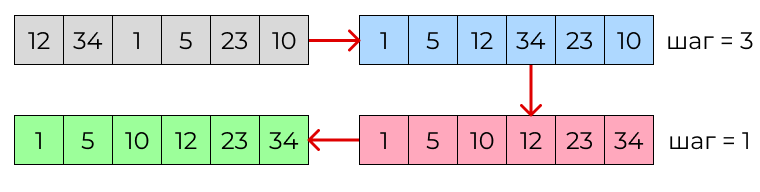
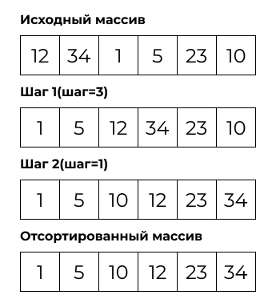
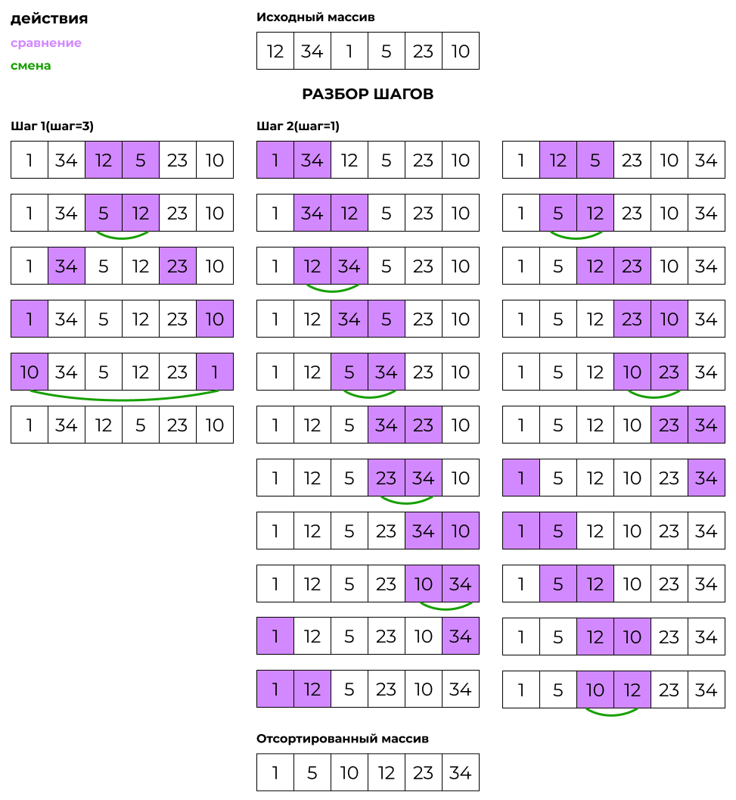
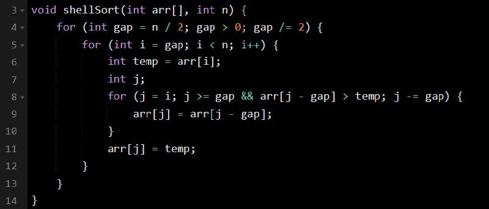

# Cортировки Шелла

## Задача: реализовать сортировку Шелла на С++

В этом репозитории можно ознакомиться с реализацией алгоритма сортировки Шелла на языке программирования C++.

### Shell sort

**Сортировка Шелла** - это алгоритм сортировки, который является усовершенствованным вариантом сортировки вставками. Суть алгоритма заключается в том, что элементы массива сортируются парами элементов друг относительно друга с фиксированным шагом. Шаг уменьшается после каждой итерации, пока не достигнет значения 1, когда выполняется финальная сортировка элементов массива.

#### Основные шаги сортировки:
<ol>
  <li>Выбирается размер промежутка (интервала) для сортировки. Этот размер уменьшается по каждой итерации сортировки.</li>
  <li>Для каждого промежутка производится сортировка вставками подмассивов, начиная с первого элемента идущего с заданным шагом.</li>
  <li>Сортировка продолжается до тех пор, пока промежуток не станет равен 1, что означает завершение сортировки.</li>
</ol>

## Давайте более подробно рассмотрим как происходит сортировка Шелла на примере
|Исход шагов|Подробно|
|--------|--------|
|||

#### Краткий итог таблицы:
При сортировке происходит сравнение чисел с шагом 3 и 1. Важно помнить, что отсчёт начинается с нуля, а не с единицы.

Также следует учесть, что числа сравниваются попарно. Если одно число меньше или больше другого, они меняются местами. В результате большие числа оказываются в конце массива, а меньшие — в начале. 

## Разбор кода
### Таблица с реализацией 
|Код shellSort|Пояснение|
|--------|--------|
||<ol><li>Исходный массив разделяем на подмассивы с помощью заданных промежутков, начиная с n/2 и уменьшая вдвое на каждом следующем шаге.</li><li>Для каждого подмассива выполняем сортировку вставками. При этом сравниваем элементы между собой и перемещаем их на нужные позиции.</li><li>После того как несколько раз отсортируем подмассивы по уменьшающимся промежуткам, выполняем финальную сортировку по всему массиву.</li></ol>|

### Таблица тестов
|Количество элементов в массиве|Элементы массива|Ожидаемый вывод|Фактический вывод|Результат|
|--------|--------|--------|--------|--------|
|5|12 6 23 9 3|3 6 9 12 23 |3 6 9 12 23 |Успешно!|
|4|7 2 15 4|2 4 7 15 |2 4 7 15 |Успешно!|
|8|45 12 30 8 16 5 21 3|3 5 8 12 16 21 30 45 |3 5 8 12 16 21 30 45 |Успешно!|
|6|17 9 4 22 13 7|4 7 9 13 17 22|4 7 9 13 17 22|Успешно!|
|3|10 2 6|2 6 10 |2 6 10 |Успешно!|
|10|33 20 1 14 7 11 25 9 4 18|1 4 7 9 11 14 18 20 25 33|1 4 7 9 11 14 18 20 25 33 |Успешно!|
|7|8 6 15 3 11 7 19|3 6 7 8 11 15 19|3 6 7 8 11 15 19|Успешно!|

## Вывод
В ходе работы был разработан и реализован алгоритм сортировки Шелла. Этот метод сортировки массива является эффективным и быстрым. Он основан на использовании последовательности уменьшающихся шагов для перемещения элементов к их окончательным позициям.

Сортировка Шелла значительно улучшает производительность по сравнению с другими методами сортировки. Реализация этого алгоритма позволила оптимизировать процесс сортировки. Я применили метод сортировки вставками на наборе подмассивов. Это способствует быстрой и эффективной обработке больших объёмов данных.

Представленный код на C++ содержит функцию shellSort, которая реализует алгоритм сортировки Шелла. Функция эффективно сортирует массивы любого размера. Для демонстрации работы алгоритма пользователь может ввести размер массива и его элементы, а также увидеть отсортированный массив.

Таким образом, реализация сортировки Шелла является важным шагом в оптимизации процесса обработки больших объёмов данных.
