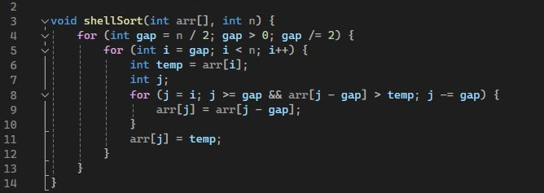

# Cортировки Шелла

## Задача: реализовать сортировку Шелла на С++

В этом репозитории можно ознакомиться с реализацией алгоритма сортировки Шелла на языке программирования C++.

### Shell sort

**Сортировка Шелла** - это алгоритм сортировки, который является усовершенствованным вариантом сортировки вставками. Суть алгоритма заключается в том, что элементы массива сортируются парами элементов друг относительно друга с фиксированным шагом. Шаг уменьшается после каждой итерации, пока не достигнет значения 1, когда выполняется финальная сортировка элементов массива.

#### Основные шаги сортировки:
<ol>
  <li>Выбирается размер промежутка (интервала) для сортировки. Этот размер уменьшается по каждой итерации сортировки.</li>
  <li>Для каждого промежутка производится сортировка вставками подмассивов, начиная с первого элемента идущего с заданным шагом.</li>
  <li>Сортировка продолжается до тех пор, пока промежуток не станет равен 1, что означает завершение сортировки.</li>
</ol>

## Давайте более подробно рассмотрим как происходит сортировка Шелла на примере
|Исход шагов|Подробно|
|--------|--------|
|||

#### Краткий итог таблицы:
При сортировке происходит сравнение чисел с шагом 3 и 1. Важно помнить, что отсчёт начинается с нуля, а не с единицы.

Также следует учесть, что числа сравниваются попарно. Если одно число меньше или больше другого, они меняются местами. В результате большие числа оказываются в конце массива, а меньшие — в начале. 

## Разбор кода
|Код ShelSort|Пояснение|
|--------|--------|
||<ol><li>Исходный массив разделяем на подмассивы с помощью заданных промежутков, начиная с n/2 и уменьшая вдвое на каждом следующем шаге.</li><li>Для каждого подмассива выполняем сортировку вставками. При этом сравниваем элементы между собой и перемещаем их на нужные позиции.</li><li>После того как несколько раз отсортируем подмассивы по уменьшающимся промежуткам, выполняем финальную сортировку по всему массиву.</li></ol>|
