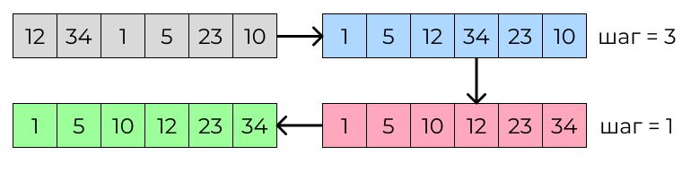

# Cортировки Шелла

## Задача: реализовать сортировку Шелла на С++

В этом репозитории можно ознакомиться с реализацией алгоритма сортировки Шелла на языке программирования C++.

### Shell sort

**Сортировка Шелла** - это алгоритм сортировки, который является усовершенствованным вариантом сортировки вставками. Суть алгоритма заключается в том, что элементы массива сортируются парами элементов друг относительно друга с фиксированным шагом. Шаг уменьшается после каждой итерации, пока не достигнет значения 1, когда выполняется финальная сортировка элементов массива.

#### Основные шаги сортировки:
<ol>
  <li>Выбирается размер промежутка (интервала) для сортировки. Этот размер уменьшается по каждой итерации сортировки.</li>
  <li>Для каждого промежутка производится сортировка вставками подмассивов, начиная с первого элемента идущего с заданным шагом.</li>
  <li>Сортировка продолжается до тех пор, пока промежуток не станет равен 1, что означает завершение сортировки.</li>
</ol>

## Давайте рассмотрим как происходит сортировка Шелла 
|Исход шагов|Подробно|
|--------|--------|
|||

#### Краткий итог таблицы:
При сортировке происходит сравнение чисел с шагом 3 и 1. Важно помнить, что отсчёт начинается с нуля, а не с единицы.

Также следует учесть, что числа сравниваются попарно. Если одно число меньше или больше другого, они меняются местами. В результате большие числа оказываются в конце массива, а меньшие — в начале. 

## Разбор кода
### Таблица структур
|Код shellSort|Пояснение|
|--------|--------|
||<ol><li>Исходный массив разделяем на подмассивы с помощью заданных промежутков, начиная с n/2 и уменьшая вдвое на каждом следующем шаге.</li><li>Для каждого подмассива выполняем сортировку вставками. При этом сравниваем элементы между собой и перемещаем их на нужные позиции.</li><li>После того как несколько раз отсортируем подмассивы по уменьшающимся промежуткам, выполняем финальную сортировку по всему массиву.</li></ol>|
|
 **Код hasDuplicates** 
|
 **Пояснение** 
|
||<ol><li>Функция bool hasDuplicates(int arr[], int n) { принимает два аргумента: массив arr целых чисел и его размер n.</li><li> Создаётся временный динамический массив tempArr размером n, в который копируется содержимое массива arr.</li><li>Временный массив tempArr сортируется в порядке возрастания.</li><li>Запускается цикл, в котором каждый элемент массива tempArr сравнивается с предыдущим элементом. Если обнаруживается повторение, выводится сообщение о наличии повторяющихся элементов, выводится отсортированный массив tempArr, освобождается память, занимаемая временным массивом, и функция возвращает true.</li><li>Если в цикле не было обнаружено повторений, память, занимаемая временным массивом, освобождается, и функция возвращает false.</li></ol>|
|
  **Код main** 
|
 **Пояснение** 
|
||<ol><li>Пользователю предлагается ввести размер массива (переменная n).</li><li>Если пользователь ввел отрицательное число или ноль, программа выводит сообщение о том, что массив пуст, и завершает работу.</li><li>Создается динамический массив arr размером n, в который будут сохранены элементы.</li><li>Пользователю предлагается ввести значения элементов массива.</li><li>Происходит проверка на правильность ввода элементов (целые числа), если ввод не верный, программа выводит сообщение об ошибке и освобождает память, затем завершает работу.</li><li>Если массив состоит из одного элемента, программа выводит соответствующее сообщение.</li><li>В противном случае происходит проверка наличия повторяющихся элементов в массиве с использованием функции hasDuplicates.</li><li>В случае, если в массиве есть повторяющиеся элементы, предполагается обработка этого случая</li><li>Если в массиве нет повторяющихся элементов, программа продолжает работу.</li><li>Происходит сортировка массива с использованием алгоритма сортировки Шелла.</li><li>Выводится отсортированный массив.</li><li>Динамический массив освобождается (delete[] arr).</li><li>Программа завершает свою работу.</li></ol>|

Директива #include <algorithm> в C++ позволяет использовать стандартную библиотеку <algorithm>, которая содержит разнообразные полезные алгоритмы для работы с контейнерами, сортировки, поиска, сравнения и других операций с данными.

В данном случае в программе применяется функция std::sort из библиотеки <algorithm>. Эта функция предназначена для сортировки элементов в заданном диапазоне контейнера. Она используется для временного массива tempArr в функции hasDuplicates, чтобы проверить наличие повторяющихся элементов в массиве.

Таким образом, использование <algorithm> позволяет применять функцию std::sort для проверки массива на наличие повторяющихся элементов. Если такие элементы обнаружены, выводится соответствующее сообщение и отсортированный массив, чтобы пользователь мог увидеть повторяющиеся значения.

### Разбор случаев
|Случай|Пояснение|
|--------|--------|
|Ввод размера массива n:|<ol><li>Если пользователь введет отрицательное число или 0, программа выведет сообщение "Массив пуст." и завершится.</li><li>Если пользователь введет положительное число, программа будет продолжать выполнение.</li></ol>|
|Ввод элементов массива:|<ol><li>При вводе элементов массива, программа проверяет каждый элемент на то, что он является целым числом. Если пользователь вводит что-то отличное от целого числа, программа выведет сообщение "Ошибка ввода. Введите целое число." и завершится.</li><li>Если пользователь ввел все целые числа, программа перейдет к следующему этапу.</li></ol>|
|Размер массива:|<ol><li>Если массив состоит из одного элемента (n == 1), программа выведет сообщение "Массив состоит из одного элемента."</li></ol>|
|Проверка на наличие повторяющихся элементов:|<ol><li>Если в массиве arr есть повторяющиеся элементы, функция hasDuplicates(arr, n) вернет true, и программа перейдет к обработке этого случая.</li><li>Если повторяющихся элементов нет, программа выведет сообщение о начале проверки на повторяющиеся элементы и перейдет к сортировке массива.</li></ol>|
|Обработка повторяющихся элементов:|<ol><li>В этом месте вам нужно указать, каким образом обрабатывать повторяющиеся элементы или что делать в случае их наличия.</li></ol>|
|Сортировка и вывод отсортированного массива:|<ol><li>Если массив не содержит повторяющихся элементов, программа осуществляет сортировку массива методом шелл-сортировки и выводит отсортированный массив на экран.</li></ol>|
|Освобождение памяти:|<ol><li>Наконец, в конце программы освобождается выделенная динамическая память для массива arr.</li></ol>|

### Таблица тестов пограничных случаев
|Пограничный случай|Количество элементов в массиве|Элементы массива|Ожидаемый вывод|Фактический вывод|Результат|
|--------|--------|--------|--------|--------|--------|
|Пустой массив|0|-|Массив пуст.|Массив пуст.|**Успешно!**|
|Массив из одного элемента|1|5|5 Массив состоит из одного элемента.|5 Массив состоит из одного элемента.|**Успешно!**|
|Массив из двух повторяющихся элементов|2|3 3|Массив состоит из повторяющихся элементов. 3 3|Массив состоит из повторяющихся элементов. 3 3|**Успешно!**|
|Уже отсортированный массив|5|2 4 6 8 10|2 4 6 8 10 Массив уже отсортирован.|2 4 6 8 10 Массив уже отсортирован.|**Успешно!**|
|Массив с элементами в обратном порядке|4|9 7 5 3|3 5 7 9|3 5 7 9|**Успешно!**|
|Массив с повторяющимися элементами|7|3 6 3 8 5 6 8|Массив состоит из повторяющихся элементов. 3 3 5 6 6 8 8|Массив состоит из повторяющихся элементов. 3 3 5 6 6 8 8|**Успешно!**|
|Ввод не целого числа|1.5|-|Ошибка ввода. Введите целое число.|Ошибка ввода. Введите целое число.|**Успешно!**|

### Таблица тестов
|Количество элементов в массиве|Элементы массива|Ожидаемый вывод|Фактический вывод|Результат|
|--------|--------|--------|--------|--------|
|5|12 6 23 9 3|3 6 9 12 23 |3 6 9 12 23 |**Успешно!**|
|4|7 2 15 4|2 4 7 15 |2 4 7 15 |**Успешно!**|
|8|45 12 30 8 16 5 21 3|3 5 8 12 16 21 30 45 |3 5 8 12 16 21 30 45 |**Успешно!**|
|6|17 9 4 22 13 7|4 7 9 13 17 22|4 7 9 13 17 22|**Успешно!**|
|3|10 2 6|2 6 10 |2 6 10 |**Успешно!**|
|10|33 20 1 14 7 11 25 9 4 18|1 4 7 9 11 14 18 20 25 33|1 4 7 9 11 14 18 20 25 33 |**Успешно!**|
|7|8 6 15 3 11 7 19|3 6 7 8 11 15 19|3 6 7 8 11 15 19|**Успешно!**|

## Вывод
В этом отчёте представлена реализация сортировки Шелла на языке C++. Был разработан алгоритм сортировки Шелла, а также функция hasDuplicates, которая проверяет наличие повторяющихся элементов в массиве.

Сортировка Шелла значительно повышает производительность по сравнению с другими методами сортировки. Моя реализация этого алгоритма позволила оптимизировать процесс сортировки. В частности, я применил метод сортировки вставками для работы с подмассивами. Это способствует быстрой и эффективной обработке больших объёмов данных.

Представленный код на C++ содержит функцию shellSort. Она реализует алгоритм сортировки Шелла и эффективно сортирует массивы любого размера. Чтобы продемонстрировать работу алгоритма, пользователь может ввести размер массива и его элементы, а затем увидеть отсортированный массив.

Таким образом, реализация сортировки Шелла является важным шагом в оптимизации процесса обработки больших объёмов данных.
